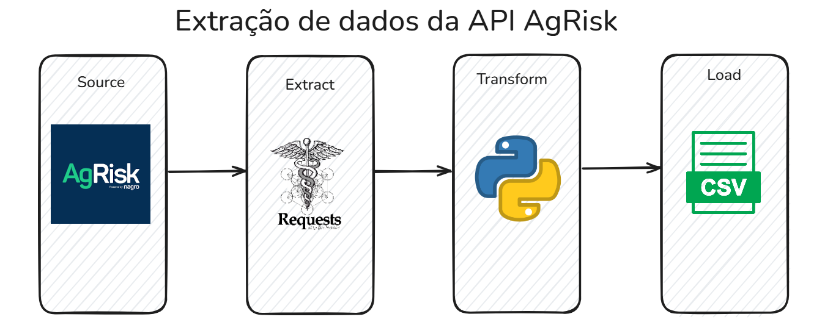

# Extração de Dados da API da plataforma AgRisk

Este projeto utiliza a plataforma AgRisk para extrair informações basicas do parceiros que estão cadastros. A AgRisk é uma plataforma que é referência em análise de crédito e risco no mercado do agronegócio. A principio decidi armazenar os dados básicos em um arquivo CSV, entranto, poderia armazenar em um arquivo excel, parquet ou até mesmo um banco de dados. Os dados coletado foram:

- **id_parceiro:** Idenficador unico do cliente no sistema
- **nome_parceiro:** Idenficador unico do cliente no sistema
- **cpf_cnpj:** Número do CPF ou CNPJ do cliente
- **tipo_entidade:** Classificação do cliente (ex.: pessoa física, pessoa jurídica).
- **data_hora_extracao:** Data/hora da extração dos dados

## Fluxo da extração dos dados

## 🛠️ Construído com

Mencione as ferramentas que você usou para criar seu projeto

* Python - Linguagem de programação principal
* requests - Biblioteca para chamadas HTTP à API
* Pandas - Manipulação e análise de dados

## ✒️ Autor
**Desenvolvedor** - [Breno do Carmo](https://www.linkedin.com/in/breno-do-carmo/)

